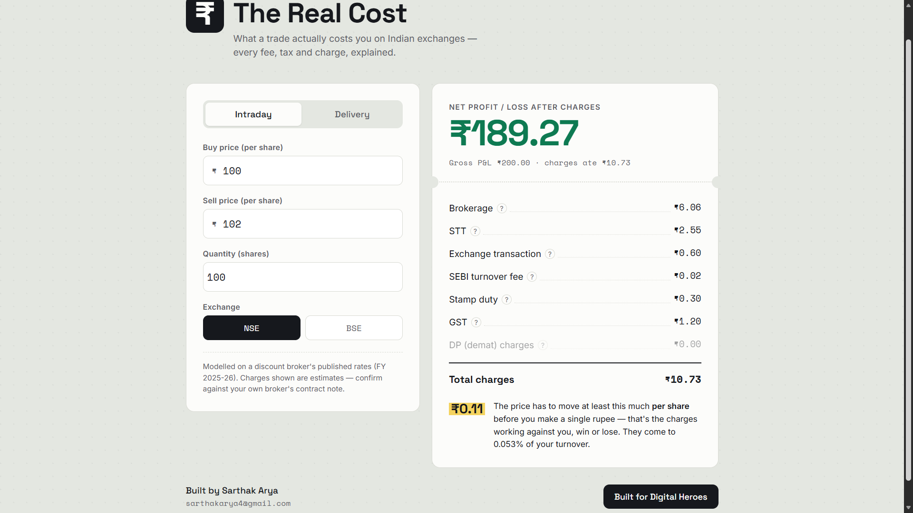

# The Real Cost

> See what a stock trade **actually** costs you on the NSE / BSE — every fee and tax, broken down and explained.


**🔗 Live demo:** _add your Vercel URL here_



---

## What it does

Enter a trade — buy price, sell price, quantity — and the calculator shows your **net profit or loss after charges**, with a full contract-note style breakdown of every cost: brokerage, STT, exchange transaction charges, the SEBI fee, stamp duty, GST and DP charges. Tap any line to read a plain-English explanation of what it is.

It leads with the number most beginners never think about: **how far the price has to move, per share, just to break even on charges** — before you make a single rupee.

## Why I built it

I trade and build trading tools, and the one cost that quietly eats into a trade is the charge stack — especially that breakeven move you need just to cover it. Every broker has a charges calculator, but they bury the one insight that matters and explain nothing. I wanted one that's clean, gives the exact number, and actually teaches a new trader what each charge is and why they're paying it.

## Features

- **Intraday and delivery** segments, with the correct charge rules for each (STT sell-side vs both-side, DP charges on delivery sells, and so on).
- **NSE and BSE** transaction rates.
- **Live breakdown** — every charge updates as you type.
- **Built-in explanations** — tap any charge to learn what it is.
- **The breakeven insight** — the per-share move required to cover all charges, plus charges as a % of turnover.
- **Transparent, editable rates** — all rates live in one place (`src/calc.js`) and match a discount broker's published FY 2025-26 structure, so they're trivial to update when SEBI or the exchanges revise them.

## How the numbers work

All charge logic is isolated in [`src/calc.js`](src/calc.js). Defaults follow a discount-broker model (FY 2025-26):

| Charge | Intraday | Delivery |
| --- | --- | --- |
| Brokerage | 0.03% or ₹20/order (lower) | Free |
| STT | 0.025%, sell side | 0.1%, both sides |
| Exchange transaction | NSE 0.00297% / BSE 0.00375% | NSE 0.00297% / BSE 0.00375% |
| SEBI turnover fee | ₹10 per crore | ₹10 per crore |
| Stamp duty | 0.003%, buy side | 0.015%, buy side |
| GST | 18% on brokerage + transaction + SEBI | 18% on brokerage + transaction + SEBI |
| DP charges | — | ₹15.34 per scrip, sell side |

## Tech stack

- **React 18** + **Vite** for a fast, zero-config build.
- **Plain CSS** — no framework, so the project drops cleanly into any host.
- No backend, no tracking, no dependencies beyond React. Everything runs in the browser.

## Run locally

```bash
npm install
npm run dev
```

Then open the printed `http://localhost:5173` URL.

## Build

```bash
npm run build      # outputs static files to dist/
npm run preview    # preview the production build locally
```

## Deploy

Import the repo on [Vercel](https://vercel.com) — it auto-detects Vite (build `npm run build`, output `dist`). Runs on the free Hobby plan with no configuration.

## Project structure

```
the-real-cost/
├── index.html
├── src/
│   ├── App.jsx        UI and state
│   ├── calc.js        charge logic + rate definitions
│   ├── index.css      styles
│   └── main.jsx       entry point
└── screenshot/
    └── preview.png
```

## Disclaimer

Charges are estimates based on a discount broker's published rates and are meant for learning and quick checks. Always confirm exact figures against your own broker's contract note before relying on them.

## Author

**Sarthak Arya**
📧 [sarthakarya4@gmail.com](mailto:sarthakarya4@gmail.com) · 🐙 [github.com/sarthak070707](https://github.com/sarthak070707)

---

<sub>Built for <a href="https://digitalheroesco.com">Digital Heroes</a>.</sub>
